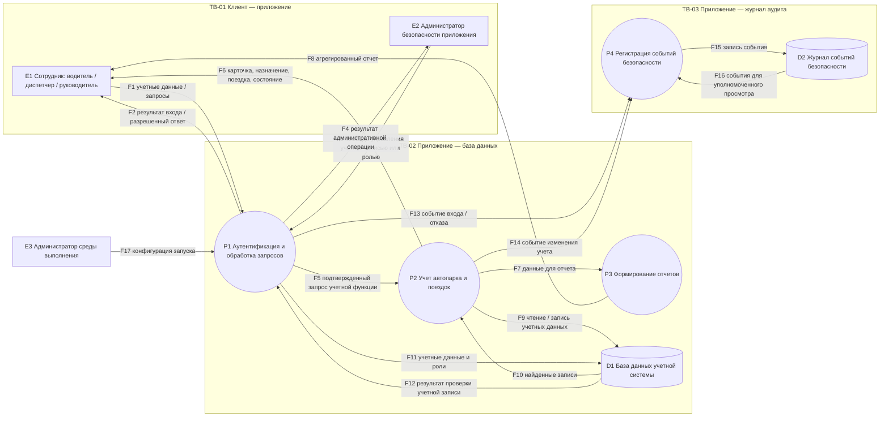

# Модель угроз

## Область анализа

Объект анализа — проектируемая система учета транспортных средств организации, индивидуальный вариант 19. Рассматриваются вход пользователей, просмотр и ведение карточек ТС, назначение ТС водителям, планирование и отчетность по поездкам, учет технического состояния, административное управление доступом и журналирование значимых операций.

В анализ включены внешние пользователи, процессы приложения, база данных учетных записей и автопарка, журнал событий, конфигурация приложения и потоки между ними. Внешняя кадровая система, физическое управление транспортом, бухгалтерский учет, телематика и фактическое отслеживание местоположения исключены: соответствующие интеграции в проекте не предусмотрены.

### Фактическое и проектируемое состояние

В текущем коде `app/config.py` загружает переменные окружения/`.env`, проверяет имя приложения, допустимое значение среды и минимальную длину `APP_SECRET_KEY`; `app/main.py` печатает стартовое сообщение без секрета. Это не веб-приложение и не реализует пользователей, аутентификацию, роли, учет ТС/поездок, БД, журнал аудита или сетевой интерфейс. Имеются три теста стартового сообщения. Защита конфигурации подтверждается наличием кода и тестами в пределах проверенных ими условий; обработка ошибок отдельно требует проверки.

Пользовательские процессы, D1/D2 и сетевые потоки диаграммы — проектируемое состояние для последующего развития. Требования SEC-* и сценарии AT-* сами по себе не подтверждают работающий контроль. Исходная версия по методичке — тег `v0.2`; анализ продолжает результаты ЛР №2 и сохраняет существующую историю Git.

### Компоненты и внешние зависимости

| ID | Элемент | Назначение и статус |
|---|---|---|
| E1 | Сотрудник: водитель, диспетчер или руководитель | Внешний участник проектируемого клиентского интерфейса; роли пока не реализованы |
| E2 | Администратор безопасности приложения | Внешний участник проектируемого интерфейса управления учетными записями, ролями и аудитом |
| E3 | Администратор среды выполнения | Локально задает конфигурацию и запускает приложение; запуск конфигурационного модуля реализован, отдельная модель его полномочий не реализована |
| P1 | Аутентификация и обработка запросов | Проектируемый прием запросов и проверка личности/полномочий |
| P2 | Учет автопарка и поездок | Проектируемые карточки, назначения, поездки и техническое состояние |
| P3 | Формирование отчетов | Проектируемые учетные и агрегированные отчеты |
| P4 | Регистрация событий безопасности | Проектируемая запись значимых операций и отказов |
| D1 | База данных учетной системы | Проектируемое хранилище профилей, ролей, карточек ТС, назначений, поездок и состояния |
| D2 | Журнал событий безопасности | Проектируемое отдельное логическое хранилище аудита; физическая отдельность/неизменяемость не подтверждена |

Внешние программные зависимости фактического прототипа: Python, `python-dotenv`; тесты используют pytest. СУБД, веб-сервер и внешний сервис идентификации не выбраны и не включены в v0.3.

## Допущения и ограничения

| ID | Допущение | Если неверно | Статус связанной защиты |
|---|---|---|---|
| ASM-01 | Клиент обращается к будущему интерфейсу приложения, прямой доступ рабочего места к D1 не предоставляется | Потребуется отдельный анализ сетевого доступа и СУБД | Требует проверки на развертывании; сейчас интерфейса нет |
| ASM-02 | Пользовательские запросы и все переданные клиентом идентификаторы считаются недоверенными | Появится ошибочное доверие к параметрам клиента и возрастет риск подмены назначения/владельца | Серверная проверка предусмотрена требованиями, но не реализована |
| ASM-03 | Служебная учетная запись приложения для D1 будет иметь только необходимые права | Компрометация приложения сможет затронуть больше данных и операций | Требует проверки после выбора СУБД и конфигурации |
| ASM-04 | Учебная среда использует искусственные учетные записи, маршруты и сведения автопарка | Реальные персональные/служебные сведения повысят последствия и потребуют пересмотра доступа и хранения | Использование искусственных данных подтверждено содержанием проектных тестовых примеров; производственное применение не подтверждено |
| ASM-05 | Журнал D2 логически отделен от D1 и доступен на запись только процессу аудита, чтение ограничено ответственным администратором | Нарушитель с правом менять D1 сможет также менять историю действий, а отказ D2 может влиять на учет | Требует проверки; физическое разделение не выбрано |
| ASM-06 | Критические изменения назначения, статуса ТС и ролей должны быть проверяемы по субъекту, времени и результату | Нельзя будет надежно разбирать фиктивную выдачу/возврат или административные изменения | SEC-7 сформулировано; полнота аудита и защита журнала требуют реализации и испытания |

Ограничения модели: это проектный анализ, не тест на проникновение и не подтверждение дефектов. Не оцениваются физическая безопасность автопарка, компрометация поставщика ОС, отказ электропитания, геолокация/телематика и правовые режимы обработки реальных персональных данных.

## Проектируемая DFD

Схема отображает логические потоки и области доверия, а не физическую топологию сети. Все процессы и хранилища, кроме загрузки конфигурации/старта приложения, запланированы.

### Описание потоков

| Поток | Содержание и направление | Статус |
|---|---|---|
| F1 | Учетные данные и пользовательские запросы: E1 → P1 | Сетевой поток проектируется |
| F2 | Результат входа и разрешенный ответ: P1 → E1 | Проектируется |
| F3 | Команда управления учетной записью/ролью: E2 → P1 | Проектируется |
| F4 | Результат административной операции: P1 → E2 | Проектируется |
| F5 | Запрос учетной функции после проверки полномочий: P1 → P2 | Проектируется |
| F6 | Данные карточки, назначения, поездки или состояния: P2 → E1 | Проектируется |
| F7 | Подготовленные данные: P2 → P3 | Проектируется |
| F8 | Агрегированный отчет: P3 → E1; детали маршрутов руководителю не выдаются согласно модели | Проектируется |
| F9 | Чтение/запись карточек и поездок: P2 → D1 | Проектируется |
| F10 | Результат чтения: D1 → P2 | Проектируется |
| F11 | Учетные данные и роли: P1 → D1 | Проектируется |
| F12 | Результат проверки учетной записи: D1 → P1 | Проектируется |
| F13 | События входа и отказов: P1 → P4 | Проектируется |
| F14 | События изменений учета: P2 → P4 | Проектируется |
| F15 | Запись аудита: P4 → D2 | Проектируется; изоляция и защита целостности не подтверждены |
| F16 | События для разрешенного просмотра: D2 → P4 | Проектируется |
| F17 | Параметры запуска: E3 → P1 | Локальная загрузка конфигурации фактически реализована; применение этих настроек к будущему серверному процессу проектируется |

### Границы доверия

| ID | Что разделяет | Пересекающие потоки | Меняющиеся предположения и необходимые проверки |
|---|---|---|---|
| TB-01 | Клиентские роли и интерфейс приложения | F1–F6, F8, F3–F4 | Клиентский ввод становится недоверенным. Проверить аутентификацию, серверную авторизацию по роли и конкретной записи, формат/размер полей, отсутствие лишних данных в ответах. Сеть пока не реализована. |
| TB-02 | Процессы приложения и D1 | F9–F12 | Входные данные приложения не должны трактоваться как безопасные SQL/команды; учетная запись БД должна быть ограничена. Проверить параметризованные запросы, права учетной записи и отсутствие прямого клиентского доступа. СУБД не выбрана. |
| TB-03 | Процесс учета/аутентификации и хранилище аудита | F13–F16 | Событие должно поступать от доверенного процесса, иметь ожидаемую структуру, а запись/чтение — ограниченные полномочия. Проверить поля субъекта/действия/времени/результата, отказ записи, квоту и защиту от изменения. Отдельная служба аудита не спроектирована, D2 пока логическое хранилище. |

## Точки входа

| Точка входа | Входные данные | Возможный источник | Необходимые проверки | Статус |
|---|---|---|---|---|
| Форма входа | Идентификатор и пароль | N-01, сотрудник | Проверка учетной записи, ограничение повторов, одинаково безопасные ответы, отсутствие секрета в журналах | Проектируется; сейчас отсутствует |
| Чтение карточки ТС/поездки | Идентификатор записи | Водитель, диспетчер | Аутентификация, право на конкретный объект, минимизация ответа | Проектируется; сейчас отсутствует |
| Создание/изменение карточки ТС | Поля ТС и статус | Диспетчер | Допустимые поля и переходы статуса, длины/форматы, роль на сервере | Проектируется; сейчас отсутствует |
| Назначение, выдача или возврат ТС | ТС, водитель, поездка, даты, статус операции | Диспетчер | Существование и совместимость объектов, запрет самовольной подмены ответственного, фиксация истории | Проектируется; сейчас отсутствует |
| Отчет о поездке/неисправности | Пробег, поездка, описание | Водитель | Принадлежность поездки, диапазон пробега, размер/формат текста | Проектируется; сейчас отсутствует |
| Управление ролями | Идентификатор пользователя, новая роль | Администратор приложения | Полномочие администратора, подтверждение изменения, аудит прежнего и нового значения | Проектируется; сейчас отсутствует |
| Просмотр отчета | Период и параметры выборки | Диспетчер/руководитель | Роль, агрегация и недопущение выдачи маршрутов роли руководителя | Проектируется; сейчас отсутствует |
| Конфигурация при запуске | APP_NAME, APP_ENV, APP_SECRET_KEY | Локальная среда запуска | Допустимая среда, непустое имя, минимальная длина секрета, недопущение вывода секрета | Реализовано для текущего локального запуска; применение к серверу не проверено |
| Прием события аудита | Субъект, действие, объект, время, результат | Процессы P1/P2 | Доверенный источник, схема события, ограничение объема, защита целостности | Проектируется; сейчас отсутствует |

## Систематический анализ STRIDE

Состояние «проектное предположение» означает сценарий для проектируемого состояния, а не найденную уязвимость. Уязвимость может быть названа подтвержденной только после проверки фактической реализации; текущий код не содержит большинства перечисленных функций.

| ID | STRIDE | Сценарий и связи | Требование | Состояние |
|---|---|---|---|---|
| TH-01 | S — подмена идентичности | N-01, AS-1, AS-2; P1, D1; F1, F11–F12; TB-01/TB-02. Нарушитель без учетной записи при отсутствии достаточного ограничения попыток подбирает учетные данные сотрудника, что позволяет действовать от его имени и раскрыть/изменить учетные сведения. | SEC-1, SEC-14 | Проектное предположение |
| TH-02 | S — подмена идентичности | N-02, AS-1, AS-5; P1; F2/F5; TB-01. Водитель использует чужой действующий или неотозванный сеанс при недостаточной привязке и отзыве сеанса, что ведет к действиям от имени другого сотрудника. | SEC-1, SEC-14 | Проектное предположение |
| TH-03 | T — изменение данных | N-03, AS-2, AS-5; P2, D1; F5–F6, F9; TB-01/TB-02. Диспетчер при отсутствии серверной проверки допустимости перехода изменяет назначение или фиксирует фиктивную выдачу/возврат, из-за чего история ответственности и поездок становится недостоверной. | SEC-2, SEC-5, SEC-15 | Проектное предположение |
| TH-04 | T — изменение данных | N-03, AS-4, AS-6; P2, D1; F5, F9–F10; TB-01/TB-02. Диспетчер при отсутствии проверки полей/статуса меняет карточку ТС или состояние обслуживания, что может привести к ошибочному решению об использовании автомобиля. | SEC-2, SEC-4, SEC-7 | Проектное предположение |
| TH-05 | T — изменение данных | N-02, AS-5; P2, D1; F1, F5–F6, F9; TB-01/TB-02. Водитель подменяет передаваемый пробег или идентификатор поездки при отсутствии серверной проверки принадлежности и диапазона, и учет пробега становится недостоверным. | SEC-2, SEC-6 | Проектное предположение |
| TH-06 | E — повышение привилегий | N-02, AS-2; P1, D1; F3–F4, F11–F12; TB-01/TB-02. Водитель меняет запрос управления ролью при проверке полномочий только в интерфейсе, получает права диспетчера/администратора и затем выполняет недоступные ему операции. | SEC-2, SEC-14 | Проектное предположение |
| TH-07 | R — отказ от авторства | N-04, AS-2, AS-7; P1, P4, D2; F3–F4, F13, F15; TB-01/TB-03. Администратор приложения при отсутствии записи исполнителя и прежнего/нового значения меняет роль, а затем оспаривает действие, и организация не может достоверно установить автора. | SEC-7, SEC-16 | Проектное предположение |
| TH-08 | I — раскрытие информации | N-02, AS-5, AS-8; P1–P3, D1; F1–F2, F5–F8, F9–F10; TB-01/TB-02. Водитель изменяет идентификатор поездки/параметры отчета при отсутствии проверки доступа к конкретной записи, получает чужой маршрут и данные назначения. | SEC-2, SEC-3 | Проектное предположение |
| TH-09 | I — раскрытие информации | N-05, AS-3; P1, D1; F17, F1–F2; TB-01. Администратор среды или пользователь с доступом к диагностике получает секрет из сообщения об ошибке/конфигурации, если обработка исключений или журналирование выведет `APP_SECRET_KEY`. | SEC-9, SEC-10 | Требует проверки для текущей обработки ошибок; раскрытие в работающем приложении не подтверждено |
| TH-10 | D — отказ в обслуживании | N-01, AS-10; P1/P2; F1, F5; TB-01. Внешний клиент отправляет большое число или чрезмерно крупные запросы при отсутствии ограничений, из-за чего исчерпываются вычислительные ресурсы и функции учета становятся недоступны. | SEC-18 | Проектное предположение |
| TH-11 | D — отказ в обслуживании | N-03 или N-05, AS-7, AS-10; P4, D2; F13–F15; TB-03. Большой поток событий или отсутствие политики хранения при исчерпании хранилища приводит к прекращению записи аудита либо нехватке пространства для работы системы. | SEC-7, SEC-16 | Проектное предположение |
| TH-12 | E — повышение привилегий / T — изменение данных | N-05, AS-4, AS-5, AS-7; P2, D1; F9–F10; TB-02. При компрометации процесса и чрезмерных правах учетной записи БД нарушитель меняет записи автопарка/поездок напрямую, расширяя ущерб за пределы одной прикладной операции. | SEC-2, SEC-17 | Проектное предположение |

### Подробные карточки сценариев

| ID | Предусловие и предполагаемое условие | Сценарий в требуемой форме | Последствия и источник предположения |
|---|---|---|---|
| TH-01 | Доступна будущая форма входа; эффективное ограничение повторов не подтверждено | Нарушитель N-01, имея сетевой доступ к проектируемой форме входа, при условии недостаточного ограничения повторных попыток подбирает учетные данные, что приводит к действиям от имени сотрудника | Компрометация AS-1/AS-2 может открыть функции учета. Источник: проектируемая F1 и SEC-1; это не подтвержденная уязвимость |
| TH-02 | Сеансы появятся после реализации входа; процедура отзыва не определена | Нарушитель N-02, имея собственную учетную запись, при условии использования чужого действующего сеанса или задержки его отзыва выполняет запросы от имени другого пользователя, что приводит к неверной атрибуции операций с поездками | Искажение AS-5 и запись под неверным субъектом в AS-7. Источник: проектируемая модель входа; требует проектирования управления сеансами |
| TH-03 | Диспетчеру разрешено вести назначения; правила фиксации выдачи/возврата не определены | Нарушитель N-03, имея учетную запись диспетчера, при условии отсутствия серверной проверки допустимого перехода назначения создает фиктивную выдачу/возврат или меняет ответственного, что приводит к недостоверной истории использования ТС | Влияет на AS-2/AS-5 и диспетчерские решения. Источник: функции F-4/F-5 и вариант «учет оборудования» методички |
| TH-04 | Карточки и сведения о ТО запланированы | Нарушитель N-03, имея право редактировать учет автопарка, при условии слабой проверки полей или перехода статуса изменяет сведения о ТС/неисправности, что приводит к неверному учету и потенциально неправильному планированию эксплуатации | AS-4/AS-6; источник: F-3/F-6, SEC-4 и реестр активов |
| TH-05 | Водитель отправляет отчет по назначенной поездке | Нарушитель N-02, имея собственную учетную запись, при условии отсутствия серверной проверки принадлежности поездки и монотонности пробега подменяет идентификатор или пробег, что приводит к искажению AS-5 | Источник: F-5, SEC-6 и назначение водителя; реальная проверка отсутствует |
| TH-06 | Управление ролями доступно только администратору по проектной матрице | Нарушитель N-02, имея учетную запись водителя, при условии проверки роли только клиентским интерфейсом посылает запрос изменения роли и получает полномочия выше выданных, что приводит к доступу к операциям диспетчера/администратора | AS-2 и дальнейшие операции с AS-4/AS-5. Источник: F-3, матрица доступа и SEC-2 |
| TH-07 | Администратор может изменять роли, D2 еще не реализовано | Нарушитель N-04, имея административную учетную запись приложения, при условии неполного аудита изменяет роль пользователя и отрицает это действие, что приводит к невозможности надежно установить исполнителя | AS-2/AS-7; источник: F13/F15 и SEC-7, запись журнала пока лишь требование |
| TH-08 | Существуют как минимум две учетные записи водителей и разные назначения | Нарушитель N-02, имея собственную учетную запись, при условии отсутствия проверки права на конкретную запись запрашивает идентификатор чужой поездки, что приводит к раскрытию маршрута и сведений о назначении | AS-5/AS-8; источник: F1/F6 и правило доступа SEC-3 |
| TH-09 | Текущая конфигурация содержит секрет; код обрабатывает ошибки стандартными механизмами Python | Нарушитель N-05, имея доступ к выводу процесса или диагностике, при условии вывода секретного значения обработчиком ошибки получает `APP_SECRET_KEY`, что приводит к ослаблению защиты конфигурации | AS-3; основание — SEC-9 требует отсутствия секрета в штатном выводе и при ошибке, причем тесты покрывают не все случаи. Фактическая утечка не установлена |
| TH-10 | Будущий интерфейс будет принимать запросы; лимиты не определены | Нарушитель N-01, имея возможность отправлять запросы, при условии отсутствия ограничения размера/частоты создает нагрузку, что приводит к недоступности учета для сотрудников | AS-10 и рабочие операции; источник: F1/F5 и проектная доступность интерфейса |
| TH-11 | D2 и журналирование значимых событий предусмотрены требованиями | Нарушитель N-03 или N-05, имея возможность вызвать множество событий или изменить среду хранения, при условии отсутствия политики объема и реакции на заполнение исчерпывает место D2, что приводит к потере аудита и возможному отказу функций | AS-7/AS-10; источник: SEC-7 и проектируемые F13–F15. Квота сейчас не задана, числовой предел не изобретается |
| TH-12 | Для будущей D1 потребуется учетная запись процесса приложения | Нарушитель N-05, имея доступ к процессу приложения, при условии избыточных прав его учетной записи БД изменяет учетные данные напрямую, что приводит к массовому искажению записей автопарка/поездок | AS-4/AS-5; источник: F9 и ASM-03. Полномочия БД еще не выбраны |

## Покрытие STRIDE

В модели представлены S (TH-01, TH-02), T (TH-03–TH-05, TH-12), R (TH-07), I (TH-08–TH-09), D (TH-10–TH-11) и E (TH-06, TH-12). Ни одна категория не исключена: каждая связана с конкретным будущим потоком, процессом или хранилищем. Указание категории не является оценкой вероятности или риска.

## Связанные документы

- [Модель нарушителя](attacker_model.md)
- [Реестр активов](assets.md)
- [Матрица доступа](access_matrix.md)
- [Требования безопасности](security_requirements.md)
- [Приемочные сценарии и прослеживаемость](acceptance_scenarios.md)
- [Реестр рисков](risk_register.md)
